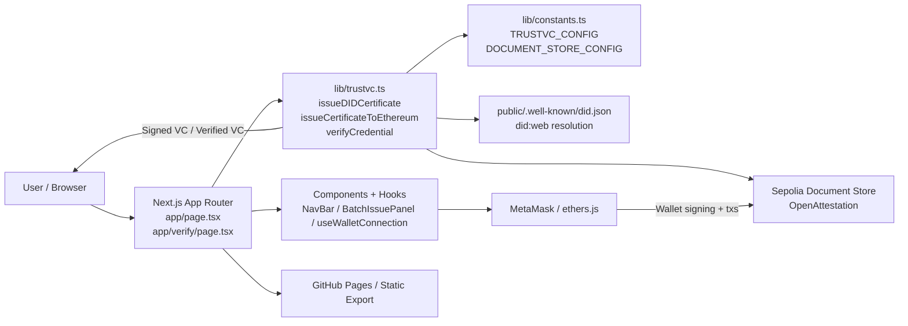
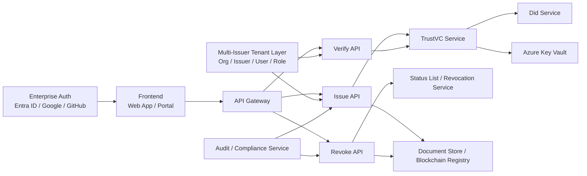

# Architecture Assessment

## Executive Summary

This repository is a functional demo and lightweight production prototype for issuing W3C verifiable credentials with TrustVC. It demonstrates DID-based signing, Ethereum document-store issuance, verification, and revocation in a Next.js static front-end. The implementation is aligned with the early TrustVC capability goal, but it does not yet meet the roadmap’s security, platform, and service architecture targets for a multi-issuer SaaS-grade issuance platform.

The primary architectural gap is that signing and verification are performed in the browser using public environment variables and a static export model. That is acceptable for a demo or a proof of concept, but it is not suitable for production issuance, tenant isolation, enterprise security, or auditable operations.

---

## 1. Current Architecture Diagram

### Current implementation characteristics

- Front-end only: the app is a static Next.js export served from GitHub Pages.
- Signing logic is embedded in lib/trustvc.ts and invoked directly from the browser.
- DID issuance depends on NEXT_PUBLIC_DID_* variables exposed to the client bundle.
- Ethereum issuance depends on MetaMask and Sepolia Document Store contract calls.
- Verification logic runs in-browser and checks both cryptographic proof validity and on-chain issuance state.
- There is no backend API layer, no persisted state, and no issuer tenancy model.

---

## 2. Target Architecture Diagram

### Target-state intent from the roadmap

The target architecture is a secure, multi-tenant service platform with:

- Server-side TrustVC signing
- Key vault-managed signing keys
- DID lifecycle management
- Revocation and status-list services
- Audit and compliance tracking
- Verification portal and public credential verification flows
- Enterprise identity and subscription layers for SaaS operations

This target architecture is substantially different from the repository’s current browser-only trust implementation.

---

## 3. Gap Analysis

| Roadmap item | Current status | Evidence in repo | Gap | Strategic impact |
|---|---|---|---|---|
| Task 1.1: TrustVC signing validation | Partial | lib/trustvc.ts contains signing and verification logic, plus validation checks | No standalone signing test project or isolated TrustVC validation harness outside the app | Harder to validate real-world signing behavior and production reliability |
| Task 1.2: Move signing server-side | Not started | No API routes or backend service exists | Browser signs credentials directly with public keys | High security risk and not production-safe |
| Task 1.3: Key Vault integration | Not started | README explicitly warns that NEXT_PUBLIC_* vars are embedded in the client bundle | No vault, retrieval service, or signing proxy | Keys are exposed and rotation is impossible in a secure model |
| Task 1.4: Refactor trustvc.ts | Not started | One monolithic lib/trustvc.ts handles signing, verification, issuance, revocation, and hashing | No service boundaries for DID, verification, issuance, or status handling | Low maintainability and poor separation of concerns |
| Phase 2.1: Organization/Issuer/User/Role model | Not started | No tenant model or persistence layer | Single-issuer app with no multi-tenant abstraction | Cannot support platform operations |
| Task 2.3: DID lifecycle management | Partial | DID document is served and signers can issue DID credentials | No generate/import/export/rotate/deactivate flows | DID operations remain manual and brittle |
| Task 2.4: Branding and issuer metadata | Partial | CERTIFICATE_TEMPLATES and ISSUER_CONFIG exist | No persistent branding model and no per-issuer customization | Not multi-tenant or enterprise-ready |
| Task 2.5: Role-based access control | Not started | No auth, no session model, no ownership separation | No authorization boundary | Cannot secure operational workflows |
| Task 3.1-3.2: Template builder and dynamic rendering | Partial | UI includes template selection and certificate rendering helpers | No visual designer and no dynamic field binding service | Template management is static and not enterprise-grade |
| Task 3.3: Bulk credential issuance | Partial | BatchIssuePanel supports CSV/Excel parsing and ZIP exports | No backend bulk job orchestration, no scalable queue, and no server-side signing | Batch operations are limited to a front-end workflow |
| Task 3.4: Revocation management | Partial | revocation functions exist for OCSP and Ethereum | No unified status service, no suspension/reinstatement workflow, no persisted audit trail | Revocation is not operationally managed at platform scale |
| Task 3.5: Verification portal | Partial | app/verify/page.tsx handles paste/upload verification | Verification is still coupled to the app and lacks a public service model | Public verification portal is conceptually present but not productized |
| Phase 4: Commercial SaaS platform | Not started | No billing, SSO, API platform, or audit platform | The project remains a standalone demo or proof-of-concept | Not positioned for commercial launch |

### Overall gap assessment

The repository is best described as a proof-of-concept TrustVC certificate playground, not yet a production-grade TrustVC platform. It addresses the early feasibility questions convincingly, but it does not satisfy the roadmap’s foundation and enterprise phases.

---

## 4. Technical Debt List

1. Monolithic TrustVC implementation
   - lib/trustvc.ts combines payload building, signing, verification, revocation, hashing, and blockchain checks.
   - This file should be split into domain services: DID service, signing service, verification service, revocation service, and issuance orchestration.

2. Browser-side secret handling
   - The project relies on public environment variables for signing keys.
   - The README itself warns that NEXT_PUBLIC_* values are visible in client-side JavaScript.

3. Static export architecture with no backend
   - The repository is configured for output: export and GitHub Pages deployment.
   - This makes server-side signing, private key access, and tenant-scoped APIs impossible without a separate backend deployment.

4. Hard-coded issuer assumptions
   - TRUSTVC_CONFIG.didUrl and related issuer values are fixed to a single public did:web issuer.
   - There is no runtime multi-issuer configuration model.

5. Fragmented credential status handling
   - Relevant verification logic strips unsupported credentialStatus entries and special-cases placeholder logic.
   - This is a sign that status-list and revocation standards are not yet fully integrated into a coherent platform design.

6. Demo network and contract configuration
   - Document store and Sepolia configuration are static demo values.
   - The project can test flows, but not enterprise deployment or issuer-specific environments.

7. No persistence or state model
   - There are no database models or durable records for issued credentials, downloads, verification events, or audit history.

8. No authentication and authorization layer
   - Metamask wallet connectivity is not equivalent to platform user authentication and cannot support enterprise RBAC.

9. Weak boundary between UX and domain logic
   - UI pages directly orchestrate issuance, validation, and revocation logic instead of delegating to a service boundary.

10. Unclear production verification trust model
    - The DID verification loader is partially self-contained and does not fully model an external DID resolution process or external verification service pipeline.

---

## 5. Security Findings

### High severity

1. Private DID signing keys are exposed to the browser
   - README states that NEXT_PUBLIC_* variables are bundled into the static JavaScript served by GitHub Pages.
   - This makes the private DID key discoverable to any user who can view the built app.
   - This violates the expected security model for a production certificate issuer.

2. Browser-side signing bypasses secure key custody
   - The signing path reads the private key from the client environment and calls signW3C directly.
   - This is acceptable only for ephemeral demo use or test-key issuance.

3. No backend trust boundary or API authentication
   - There is no secure issue or verify endpoint with authorization, rate limiting, or policy enforcement.

### Medium severity

1. Static public DID resolution may be stale or misconfigured
   - The repo depends on a did:web document stored in public/.well-known/did.json.
   - If the document or keys drift, verification fails and trust is broken.

2. OCSP revocation and blockchain revocation are handled in-browser
   - This creates a user-experience risk and makes the platform vulnerable to tampering if the browser path is abused.

3. No audit log or operational telemetry
   - The project currently has no durable record of issuance, verification, download, or revocation events.

### Medium/Low risk but notable

- The hard-coded DID public key construction and comments around environment usage suggest there is still a manual configuration burden and some drift risk.
- The verification path includes a fallback and placeholder logic for credential status handling, which is a sign of incomplete standards support.

---

## 6. TrustVC Integration Findings

### Strengths

- The project uses TrustVC in a meaningful way rather than as a placeholder.
- DID issuance is configured with W3C VC v2 semantics and `ecdsa-sd-2023` signing.
- Verification logic uses `verifyDocument` with a document loader and checks issuer identity alignment.
- Ethereum issuance is mapped to the OpenAttestation Document Store model and includes revocation semantics.
- The repo incorporates both DID and Ethereum issuance methods, which is a good architectural flex point for a phased rollout.

### Gaps and concerns

1. The trust model is not split into server and client responsibilities
   - TrustVC signing is executed in the browser, which means credential issuance authority is not isolated behind a backend service.

2. The signing configuration is partially environment-driven and partially static
   - There are signs of a hard-coded issuer DID and mixed configuration patterns, including comments such as a hardcoded key ID in getDIDKeyPairFromEnv.
   - This suggests incomplete refactoring and a risk of wrong key usage.

3. Verification is stronger than issuance security
   - The project does a good job verifying credentials, but the actual issuance authority is not guarded by application-level trust infrastructure.

4. Status-list and revocation service maturity is limited
   - The code has revocation capability, but no robust status-list implementation, no suspension/reinstatement workflow, and no centralized revocation policy service.

5. Multi-issuer semantics are absent
   - The code supports multiple issuing methods, but not multiple issuer identities or tenant-specific credentials.

6. Contract trust is demo-oriented
   - Using the default demo document store is useful for learning, but not acceptable for a production-grade TrustVC platform without issuer-specific contract governance.

---

## 7. Recommended Implementation Order

### Phase 1: Secure the TrustVC foundation

1. Create a backend API layer with issue, verify, and revoke endpoints.
2. Move signing to a server-side service and remove all private keys from browser bundles.
3. Introduce Azure Key Vault or equivalent key management.
4. Standardize a single VC payload structure and define a formal issuance contract.
5. Add a standalone TrustVC validation project for signing and verification regression tests.

### Phase 2: Refactor and isolate services

1. Split lib/trustvc.ts into service boundaries:
   - DidService
   - IssuanceService
   - VerificationService
   - RevocationService
2. Replace static constants with tenant and environment configuration models.
3. Add a proper issuer configuration repository and DID lifecycle management domain.

### Phase 3: Multi-issuer platform foundation

1. Introduce Organization, Issuer, User, and Role modeling.
2. Add issuer workspace management: create, edit, disable.
3. Add platform auth and RBAC.
4. Support issuer-specific branding, DID metadata, and verification display settings.

### Phase 4: Revocation, verification, and portal productization

1. Implement credential status lists and central revocation service.
2. Add suspension and reinstatement flows.
3. Expand the verification portal with JSON upload, paste, QR scan, and audit reporting.
4. Add public verification URLs and recipient delivery workflows.

### Phase 5: Bulk issuance and enterprise features

1. Build a resilient bulk issuance pipeline for CSV/Excel/JSON input.
2. Add template-building capabilities and dynamic data mapping.
3. Introduce audit logging and operational compliance reporting.
4. Add enterprise authentication and subscription controls.

### Phase 6: SaaS readiness

1. Add billing, plan enforcement, and quota management.
2. Add API platform controls, rate limits, and SOC/compliance tooling.
3. Add multi-environment deployment and operational observability.
4. Migrate from demo document store usage to issuer-owned registry governance.

---

## Conclusion

The repository demonstrates that TrustVC-based certificate issuance is technically viable in a browser-first, low-friction web app. However, the current implementation is still best classified as a prototype and a strong proof of concept. The roadmap clearly calls for a secure, server-managed, multi-issuer platform with DID lifecycle, key custody, revocation management, auditability, and SaaS controls. Those capabilities are not implemented yet.

The next move should not be feature expansion first; it should be security and architecture hardening first. The repository needs a backend TrustVC service layer, private key custody, and proper domain-service boundaries before it can credibly satisfy the roadmap’s production and commercial objectives.
