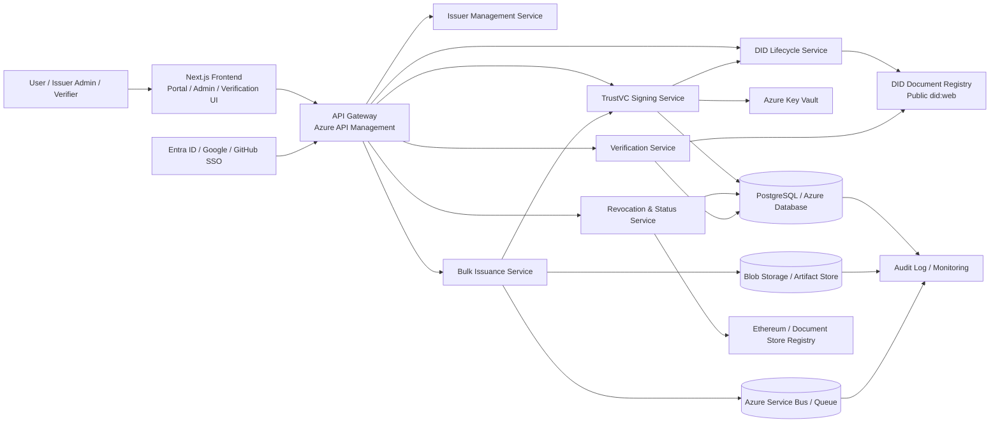
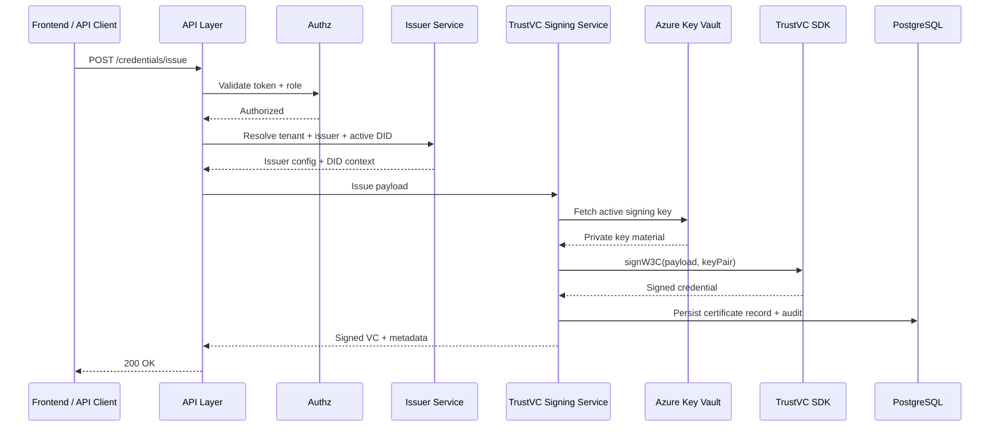
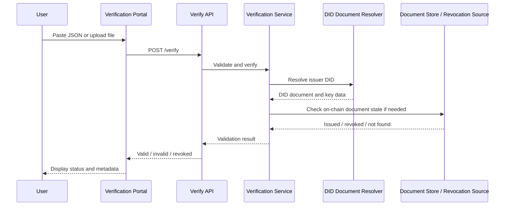

# Technical Specification: Multi-Tenant TrustVC Certificate Issuance Platform

## 1. Overview

This specification defines the architecture and engineering design required to transform the current repository from a single-issuer static web app into a secure, multi-tenant TrustVC certificate issuance platform. The solution is designed for enterprise use, tenant isolation, API-driven issuance, DID lifecycle management, revocation controls, and public verification.

The platform will support:

- Multiple organizations and issuers
- Secure TrustVC signing in a backend service layer
- Azure Key Vault-backed key management
- W3C Verifiable Credential issuance and verification
- Revocation and status tracking
- Bulk issuance for large certificate runs
- Public verification portal and recipient delivery
- Enterprise SSO and RBAC

---

## 2. Business Objectives

- Move from demo-grade issuance to secure production issuance.
- Support multi-tenant operations across multiple organizations.
- Keep all private signing material out of the browser and out of client bundles.
- Provide auditable issuance and verification flows.
- Offer scalable bulk issuance for enterprise credential programs.
- Enable public and internal verification experiences with consistent trust semantics.

---

## 3. Design Principles

1. Security by default
   - No private keys in frontend code, browser storage, or public static assets.
   - Secrets stored only in Azure Key Vault.
   - All sensitive operations executed in secure backend services.

2. Tenant isolation
   - Every issuer and credential workspace is isolated by tenant and issuer identity.
   - Storage, keys, and signing policy are scoped per issuer.

3. Standard-first interoperability
   - W3C Verifiable Credential output using TrustVC-compatible signing and verification semantics.
   - DID resolution over did:web and standard verification methods.

4. API-first architecture
   - Browser front-end is only a client for the platform API.
   - Bulk operations, import jobs, and issuance logic run in backend services.

5. Observability and auditability
   - Every issuance, verification, revocation, download, and status change is recorded.

---

## 4. High-Level Target Architecture



---

## 5. Azure Architecture

### 5.1 Azure Services

| Service | Purpose | Notes |
|---|---|---|
| Azure App Service / Container Apps | Front-end and API hosting | Web app and API layers can run separately or together |
| Azure API Management | Secure public API gateway | Rate limiting, auth, usage policies |
| Azure Functions | Lightweight serverless signing and revocation handlers | Fit for isolated TrustVC actions |
| Azure Key Vault | Secret and key protection | Hosts signing keys and DID material |
| Azure PostgreSQL | Core transactional data | Tenants, issuers, certificates, users, templates |
| Azure Service Bus | Async bulk issuance and event processing | Decouples import jobs and processing |
| Azure Blob Storage | Credential exports, templates, PDFs, attachments | Stores generated ZIP packages and rendered artifacts |
| Azure Monitor / Application Insights | Logging, tracing, metrics | Required for audit, SLA monitoring, and debugging |
| Azure Front Door / CDN | Edge routing and security | Optional for public verification portal |
| Microsoft Entra ID | SSO and RBAC identity provider | Integrates with platform admin and issuer identities |
| Azure Container Registry | Secure image hosting | If using containers for background workers |

### 5.2 Network and Security Design

- Public entry points: only the web app and API gateway are externally accessible.
- Internal services such as signing and database calls are private by default.
- Azure managed identity is used for Key Vault and database access.
- Private endpoints are recommended for PostgreSQL and Key Vault.
- API layers enforce OAuth2 / OIDC identity and tenant-scoped authorization.

### 5.3 Deployment Topology

- Production environment:
  - Front-end application in App Service or static hosting behind CDN
  - API services in App Service or Azure Functions
  - PostgreSQL in Azure Database for PostgreSQL
  - Queue-based background workers for bulk issuance
  - Blob storage for credential exports and generated PDF assets

---

## 6. Solution Components

### 6.1 Frontend

The existing Next.js app remains the user experience layer but is converted from a static client-only app to a secure portal with:

- Tenant-aware organization dashboard
- Issuer workspace management
- Certificate template designer
- Bulk issuance workflow UI
- Verification portal
- Audit log dashboards

### 6.2 API Layer

The API layer becomes the sole integration point for issuance and verification logic.

Responsibilities:

- Tenant and issuer resolution
- Authorization validation by role and scope
- Request validation
- Signing orchestration
- Verification orchestration
- Revocation status enforcement
- Audit event capture

### 6.3 TrustVC Signing Service

Responsible for:

- Building canonical VC payloads
- Resolving issuer DID and signing key
- Retrieving secret material from Azure Key Vault
- Running the TrustVC signing flow
- Returning signed credential JSON and metadata

### 6.4 DID Service

Responsible for:

- DID generation
- Import and export
- Public DID document management
- Key rotation and deactivation
- DID-to-issuer mapping

### 6.5 Revocation Service

Responsible for:

- Credential revocation state management
- OCSP or status-list integration
- Blockchain revocation for Ethereum-backed credentials
- Reinstatement and suspension processing

### 6.6 Verification Service

Responsible for:

- Signature verification with TrustVC
- DID document resolution and proof validation
- On-chain document checks
- Status lookup and revocation enforcement
- Verification audit records

### 6.7 Bulk Issuance Service

Responsible for:

- CSV / Excel / JSON import parsing
- Validation and normalization
- Job orchestration and retry semantics
- Batch signing and ZIP generation
- Completion status and artifact storage

---

## 7. Database Schema

### 7.1 Core Principles

- PostgreSQL is the system of record.
- Data is strongly typed with explicit timestamps and soft-delete support.
- Tenants and issuers are first-class entities.
- Verification and audit events are immutable.
- All bulk issuance jobs are tracked as workflow records.

### 7.2 Tables

#### tenants

```sql
CREATE TABLE tenants (
  id UUID PRIMARY KEY,
  name VARCHAR(255) NOT NULL,
  slug VARCHAR(100) UNIQUE NOT NULL,
  status VARCHAR(32) NOT NULL DEFAULT 'active',
  created_at TIMESTAMPTZ NOT NULL DEFAULT NOW(),
  updated_at TIMESTAMPTZ NOT NULL DEFAULT NOW()
);
```

#### issuers

```sql
CREATE TABLE issuers (
  id UUID PRIMARY KEY,
  tenant_id UUID NOT NULL REFERENCES tenants(id),
  name VARCHAR(255) NOT NULL,
  slug VARCHAR(100) NOT NULL,
  website_url TEXT,
  description TEXT,
  logo_url TEXT,
  theme_color VARCHAR(32),
  verification_branding JSONB,
  status VARCHAR(32) NOT NULL DEFAULT 'active',
  created_at TIMESTAMPTZ NOT NULL DEFAULT NOW(),
  updated_at TIMESTAMPTZ NOT NULL DEFAULT NOW(),
  UNIQUE (tenant_id, slug)
);
```

#### users

```sql
CREATE TABLE users (
  id UUID PRIMARY KEY,
  tenant_id UUID NOT NULL REFERENCES tenants(id),
  email VARCHAR(255) UNIQUE NOT NULL,
  full_name VARCHAR(255),
  auth_provider VARCHAR(64) NOT NULL,
  external_subject VARCHAR(255),
  status VARCHAR(32) NOT NULL DEFAULT 'active',
  created_at TIMESTAMPTZ NOT NULL DEFAULT NOW(),
  last_login_at TIMESTAMPTZ
);
```

#### roles

```sql
CREATE TABLE roles (
  id UUID PRIMARY KEY,
  tenant_id UUID NOT NULL REFERENCES tenants(id),
  name VARCHAR(64) NOT NULL,
  description TEXT,
  UNIQUE (tenant_id, name)
);
```

#### user_roles

```sql
CREATE TABLE user_roles (
  user_id UUID NOT NULL REFERENCES users(id),
  role_id UUID NOT NULL REFERENCES roles(id),
  issuer_id UUID REFERENCES issuers(id),
  PRIMARY KEY (user_id, role_id, issuer_id)
);
```

#### did_identities

```sql
CREATE TABLE did_identities (
  id UUID PRIMARY KEY,
  tenant_id UUID NOT NULL REFERENCES tenants(id),
  issuer_id UUID NOT NULL REFERENCES issuers(id),
  did_uri TEXT NOT NULL,
  key_id TEXT NOT NULL,
  controller_uri TEXT NOT NULL,
  public_key_multibase TEXT NOT NULL,
  key_vault_secret_name TEXT,
  key_vault_version TEXT,
  status VARCHAR(32) NOT NULL DEFAULT 'active',
  created_at TIMESTAMPTZ NOT NULL DEFAULT NOW(),
  updated_at TIMESTAMPTZ NOT NULL DEFAULT NOW(),
  rotated_from_did_id UUID REFERENCES did_identities(id),
  UNIQUE (issuer_id, did_uri)
);
```

#### credential_templates

```sql
CREATE TABLE credential_templates (
  id UUID PRIMARY KEY,
  tenant_id UUID NOT NULL REFERENCES tenants(id),
  issuer_id UUID NOT NULL REFERENCES issuers(id),
  name VARCHAR(255) NOT NULL,
  template_type VARCHAR(64) NOT NULL,
  schema_version VARCHAR(32) NOT NULL,
  body JSONB NOT NULL,
  is_default BOOLEAN NOT NULL DEFAULT FALSE,
  status VARCHAR(32) NOT NULL DEFAULT 'active',
  created_at TIMESTAMPTZ NOT NULL DEFAULT NOW(),
  updated_at TIMESTAMPTZ NOT NULL DEFAULT NOW()
);
```

#### certificates

```sql
CREATE TABLE certificates (
  id UUID PRIMARY KEY,
  tenant_id UUID NOT NULL REFERENCES tenants(id),
  issuer_id UUID NOT NULL REFERENCES issuers(id),
  did_id UUID REFERENCES did_identities(id),
  template_id UUID REFERENCES credential_templates(id),
  external_id VARCHAR(255),
  credential_json JSONB NOT NULL,
  credential_subject JSONB NOT NULL,
  status VARCHAR(32) NOT NULL DEFAULT 'issued',
  issued_at TIMESTAMPTZ NOT NULL DEFAULT NOW(),
  valid_from TIMESTAMPTZ,
  valid_until TIMESTAMPTZ,
  revoked_at TIMESTAMPTZ,
  suspended_at TIMESTAMPTZ,
  created_at TIMESTAMPTZ NOT NULL DEFAULT NOW(),
  updated_at TIMESTAMPTZ NOT NULL DEFAULT NOW()
);
```

#### credential_status_events

```sql
CREATE TABLE credential_status_events (
  id UUID PRIMARY KEY,
  certificate_id UUID NOT NULL REFERENCES certificates(id),
  event_type VARCHAR(32) NOT NULL,
  reason TEXT,
  actor_user_id UUID REFERENCES users(id),
  created_at TIMESTAMPTZ NOT NULL DEFAULT NOW(),
  metadata JSONB
);
```

#### issuance_jobs

```sql
CREATE TABLE issuance_jobs (
  id UUID PRIMARY KEY,
  tenant_id UUID NOT NULL REFERENCES tenants(id),
  issuer_id UUID NOT NULL REFERENCES issuers(id),
  created_by UUID REFERENCES users(id),
  job_type VARCHAR(64) NOT NULL,
  source_type VARCHAR(32) NOT NULL,
  source_ref TEXT,
  status VARCHAR(32) NOT NULL DEFAULT 'queued',
  total_records INTEGER NOT NULL DEFAULT 0,
  processed_records INTEGER NOT NULL DEFAULT 0,
  failed_records INTEGER NOT NULL DEFAULT 0,
  artifact_blob_url TEXT,
  created_at TIMESTAMPTZ NOT NULL DEFAULT NOW(),
  updated_at TIMESTAMPTZ NOT NULL DEFAULT NOW()
);
```

#### issuance_job_items

```sql
CREATE TABLE issuance_job_items (
  id UUID PRIMARY KEY,
  job_id UUID NOT NULL REFERENCES issuance_jobs(id),
  row_number INTEGER NOT NULL,
  input_payload JSONB NOT NULL,
  certificate_id UUID REFERENCES certificates(id),
  status VARCHAR(32) NOT NULL DEFAULT 'pending',
  error_message TEXT,
  created_at TIMESTAMPTZ NOT NULL DEFAULT NOW(),
  updated_at TIMESTAMPTZ NOT NULL DEFAULT NOW()
);
```

#### verification_events

```sql
CREATE TABLE verification_events (
  id UUID PRIMARY KEY,
  tenant_id UUID REFERENCES tenants(id),
  certificate_id UUID REFERENCES certificates(id),
  verifier_type VARCHAR(32),
  result VARCHAR(32) NOT NULL,
  detail JSONB,
  created_at TIMESTAMPTZ NOT NULL DEFAULT NOW()
);
```

#### audit_logs

```sql
CREATE TABLE audit_logs (
  id UUID PRIMARY KEY,
  tenant_id UUID REFERENCES tenants(id),
  issuer_id UUID REFERENCES issuers(id),
  actor_user_id UUID REFERENCES users(id),
  entity_type VARCHAR(128) NOT NULL,
  entity_id UUID,
  action VARCHAR(128) NOT NULL,
  metadata JSONB,
  created_at TIMESTAMPTZ NOT NULL DEFAULT NOW()
);
```

---

## 8. API Design

### 8.1 API Principles

- Versioned endpoints: /api/v1/
- JSON-only request/response contract
- All endpoints require authentication and authorization
- Every mutating request creates an audit log event
- Public verification endpoints are separate from protected issuer APIs

### 8.2 Core APIs

#### Authentication

- OAuth 2.0 / OIDC via Entra ID, Google Workspace, GitHub
- JWT access token with issuer and tenant scopes
- Role claims mapped to application permissions

#### Issuer APIs

##### POST /api/v1/issuers
- Create issuer workspace
- Request: tenant_id, name, slug, website_url, verification_branding
- Response: issuer object

##### GET /api/v1/issuers/{issuerId}
- Fetch issuer metadata

##### PATCH /api/v1/issuers/{issuerId}
- Update branding / profile / status

##### POST /api/v1/issuers/{issuerId}/dids
- Create DID identity

##### POST /api/v1/issuers/{issuerId}/dids/{didId}/rotate
- Rotate DID key

##### POST /api/v1/issuers/{issuerId}/dids/{didId}/deactivate
- Disable DID for future signing

##### POST /api/v1/issuers/{issuerId}/credentials/issue
- Issue a single credential
- body:
  ```json
  {
    "credentialSubject": {
      "name": "Alice Example",
      "email": "alice@example.com",
      "certificateType": "Professional Certificate"
    },
    "templateId": "uuid",
    "validFrom": "2026-01-01T00:00:00Z",
    "validUntil": "2027-01-01T00:00:00Z"
  }
  ```

##### POST /api/v1/issuers/{issuerId}/credentials/bulk
- Start bulk issuance job

##### POST /api/v1/issuers/{issuerId}/credentials/{credentialId}/revoke
- Revoke credential

##### POST /api/v1/issuers/{issuerId}/credentials/{credentialId}/suspend
- Suspend credential status

##### POST /api/v1/issuers/{issuerId}/credentials/{credentialId}/reinstate
- Restore active status

#### Verification APIs

##### POST /api/v1/verify
- Public or authenticated credential verification
- body: raw VC JSON
- response: verification result with status, issuer, proof validation, revocation state

##### GET /api/v1/credentials/{credentialId}
- Retrieve credential metadata and public details

##### GET /api/v1/credentials/{credentialId}/status
- Get current revocation and validity status

#### Jobs APIs

##### GET /api/v1/jobs/{jobId}
- Get bulk issuance status

##### GET /api/v1/jobs/{jobId}/items
- Fetch batch item processing results

### 8.3 Response Model

```json
{
  "success": true,
  "data": {},
  "meta": {
    "requestId": "uuid",
    "traceId": "uuid",
    "timestamp": "2026-08-12T00:00:00Z"
  }
}
```

### 8.4 Error Model

```json
{
  "success": false,
  "error": {
    "code": "ISSUANCE_FORBIDDEN",
    "message": "Issuer is not active or lacks signing privileges.",
    "details": {}
  }
}
```

---

## 9. DID Lifecycle Management

### 9.1 DID Design

The platform uses a did:web-based issuance model, with each issuer having one or more active DIDs. DID metadata is stored in PostgreSQL and public DID documents are served from a public endpoint controlled by the platform or issuer domain.

### 9.2 DID Lifecycle States

- pending
- active
- rotating
- inactive
- revoked
- deactivated

### 9.3 Supported Flows

#### Create DID

- User selects issuer workspace
- System generates key pair or imports external key material
- Key is stored in Azure Key Vault
- DID document is constructed and published to public location
- DID metadata stored in the database

#### Import DID

- Existing public DID and verification method details are uploaded
- System validates the DID document
- Key metadata is mapped to the issuer and stored securely

#### Rotate Key

- A new signing key is created in Key Vault
- Existing DID document is updated or replaced with the new verification method
- System marks the previous key as legacy but still readable for historical verification
- New issuance uses only the active key

#### Deactivate DID

- Mark DID status as deactivated
- Prevent new credential issuance using that DID
- Preserve historical verification capability where necessary

#### Export DID

- Export DID metadata and public verification method for backup or migration

### 9.4 Security Controls

- DID private keys never leave Key Vault
- DID issuer metadata is scoped to the tenant
- Rotations require admin authorization
- All DID lifecycle events are recorded in audit logs

---

## 10. TrustVC Signing Service

### 10.1 Responsibilities

- Build canonical VC payload
- Validate issuer configuration and DID
- Fetch key material from Key Vault
- Invoke TrustVC signing API
- Return signed-proof credential JSON
- Return signing metadata and transaction audit fields

### 10.2 Signing Sequence



### 10.3 Signing Requirements

- Signing occurs only inside the backend service boundary.
- All signing attempts are bound to a valid issuer and active DID.
- Signing fails closed if no active key is available.
- The public DID document must match the signing key identifier.

### 10.4 Output Contract

Signed VC output includes:

- @context
- type
- issuer
- issuanceDate
- validFrom / validUntil
- credentialSubject
- proof
- status metadata if applicable

---

## 11. Revocation Service

### 11.1 Requirements

The revocation service handles:

- credential revocation
- suspension
- reinstatement
- cryptographic status checks
- Ethereum document-store revocation
- OCSP or status list integration for DID-based credentials

### 11.2 Revocation Modes

1. DID credential revocation via OCSP responder or status list
2. Ethereum-backed document store revocation
3. Platform-level suspension for compliance or operational reasons

### 11.3 Service Design

- Receives a certificate identifier and reason
- Resolves credential and issuer metadata
- Computes correct document hash or target hash
- Calls blockchain or status-list implementation
- Updates database status
- Writes event record in audit log

### 11.4 API Endpoints

- POST /api/v1/credentials/{credentialId}/revoke
- POST /api/v1/credentials/{credentialId}/suspend
- POST /api/v1/credentials/{credentialId}/reinstate

---

## 12. Verification Portal

### 12.1 Goals

The public verification portal allows:

- upload of credential JSON
- paste credential JSON directly
- QR code scanning for verification
- display of trusted issuer metadata
- clear validation output for validity, signature, and revocation status

### 12.2 Components

- Verification UI page
- Verification request API
- Proof validation service
- DID document resolution client/server component
- Revocation status checker

### 12.3 Verification Flow



### 12.4 Verification Result Model

```json
{
  "valid": true,
  "status": "valid",
  "issuer": "did:web:example.com",
  "credentialId": "urn:uuid:...",
  "proofVerified": true,
  "onChainVerified": true,
  "revoked": false,
  "message": "Credential verified successfully"
}
```

---

## 13. Bulk Issuance Architecture

### 13.1 Goals

Support large certificate runs from Excel, CSV, or JSON file sources while ensuring traceability and safe processing.

### 13.2 Components

- Bulk import API
- File parser service
- Data normalization layer
- Validation engine
- Job scheduler and queue worker
- Signing orchestrator
- Artifact generator (ZIP, JSON, PDF if required)

### 13.3 Import Formats Supported

- CSV
- Excel (.xlsx, .xls)
- JSON arrays of records

### 13.4 Bulk Flow


### 13.5 Bulk Job States

- queued
- validating
- processing
- partial_failure
- completed
- failed
- cancelled

### 13.6 Required Controls

- Row-level validation before signing
- Retry strategy for transient failures
- Idempotent job processing
- Downloadable verification package after completion
- Mandatory audit record for each successful or failed item

---

## 14. Security Architecture

### 14.1 Identity and Access

- Entra ID / Google / GitHub SSO for human access
- API tokens for service-to-service access
- Tenant-bound RBAC
- Issuer-specific permission policy matrix

### 14.2 Secret Management

- Private keys stored in Azure Key Vault only
- Managed identities for runtime access
- Controlled access by issuer and environment
- Rotation strategy with versioned keys

### 14.3 Compliance Controls

- All mutating actions generate audit logs
- Sensitive actions require strong authorization
- Data encryption at rest and in transit
- Response redaction for secret values

---

## 15. Observability and Operations

### 15.1 Monitoring

- Application Insights for API, function, and frontend telemetry
- Log correlation by requestId and traceId
- Alerting on signing failures, revocation issues, and key access problems

### 15.2 Operational Metrics

- issued credential count
- verification count
- revocation count
- bulk job success rate
- API latency
- failure by error code

---

## 16. Non-Functional Requirements

### Performance

- Single issuance latency under 2 seconds in steady state
- Bulk issuance throughput tuned for job queue processing
- Verification API p95 under 1 second for standard VC checks

### Availability

- API platform availability target: 99.9%
- Signing service resilient to Key Vault or downstream dependency delays

### Scalability

- Horizontal scaling for API and worker services
- Service Bus-based decoupling for bulk and async workflows
- Partition-aware or sharded strategy if tenant volume grows significantly

### Reliability

- Retry strategy with idempotent endpoint design
- Durable job tracking
- Recovery from partial bulk issuance failures

---

## 17. Migration Plan from Current Repository

### Phase 1: Security baseline

- Move signing to backend service
- Remove all client secret material
- Add Key Vault-backed signing keys

### Phase 2: Platform foundation

- Add tenant, issuer, and RBAC models
- Introduce PostgreSQL persistence
- Split TrustVC logic into services

### Phase 3: Product platformization

- Add bulk issuance, verification portal, and status management
- Add audit logging and template management

### Phase 4: Enterprise and SaaS capabilities

- Add SSO, billing, public API, and enterprise integrations

---

## 18. Acceptance Criteria for Target State

The repository is considered successfully transformed when all of the following are true:

- All signing keys are stored in Azure Key Vault and never in browser bundles.
- Multiple tenants and issuers can coexist under the same platform.
- Issuance, verification, and revocation are all server-side operations.
- Verification portal supports public credential validation.
- Bulk issuance workflows can process large CSV/Excel/JSON imports.
- DID lifecycle operations are supported for generation, rotation, and deactivation.
- Audit records exist for all major issuance and status transitions.
- The platform supports enterprise authentication and authorization policies.

---

## 19. Summary

This specification defines a secure, enterprise-grade multi-tenant TrustVC certificate issuance platform that preserves the best parts of the current repository while addressing its key architectural gaps. The primary transformation is to move from a static browser-first proof of concept into a backend-driven credential platform built on Azure services, robust data modeling, managed key custody, and a formal multi-issuer issuance model.
