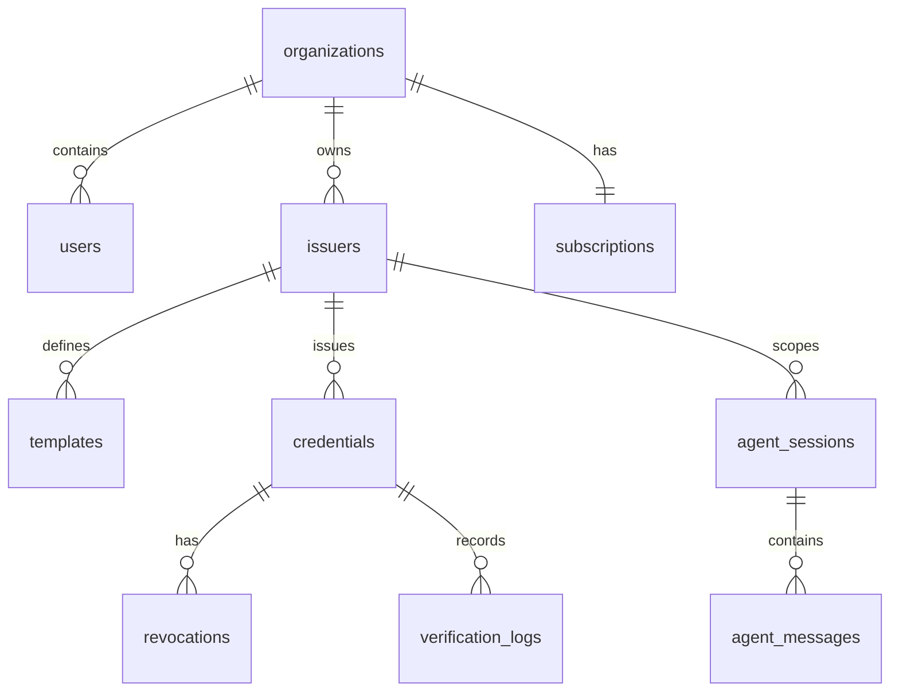

# Netlify Database Schema

The initial production schema is [001_initial_schema.sql](../database/migrations/001_initial_schema.sql). It uses PostgreSQL UUID primary keys, UTC timestamps, foreign keys, parameterized service access, and update triggers.

## Core tenancy and identity

| Table | Purpose |
| --- | --- |
| `organizations` | Tenant boundary and subscription owner. |
| `users` | Authenticated users, organization membership, and roles. |
| `issuers` | Issuer workspace, DID URI, contact, and issuance status. |
| `subscriptions` | Organization plan, lifecycle state, seats, and renewal boundary. |
| `api_keys` | Hashed API keys, scopes, expiration, and revocation metadata. |

## Credential lifecycle

| Table | Purpose |
| --- | --- |
| `templates` | Issuer/global certificate template definitions in JSONB. |
| `credentials` | Issued VC payload, recipient index fields, status, validity, document hash, and issuance methods. |
| `revocations` | Immutable lifecycle actions for revoke, suspend, and reinstate. |
| `verification_logs` | Verification results without requiring storage of the entire incoming document. |

## Agent and audit

| Table | Purpose |
| --- | --- |
| `agent_sessions` | Issuer/user-scoped current page, workflow, and session memory. |
| `agent_messages` | Ordered user, assistant, and system messages with JSONB metadata. |
| `audit_logs` | Credential, verification, revocation, agent, and admin events. |

## Relationships

## Access rules

- All queries are parameterized through [lib/db.ts](../lib/db.ts).
- Application authentication must scope every production query by organization and issuer before exposing multi-tenant data.
- API keys are stored only as `key_hash`; never store plaintext keys.
- Agent content is limited to 16,000 characters per message, and secrets are blocked by the agent guardrails before persistence.